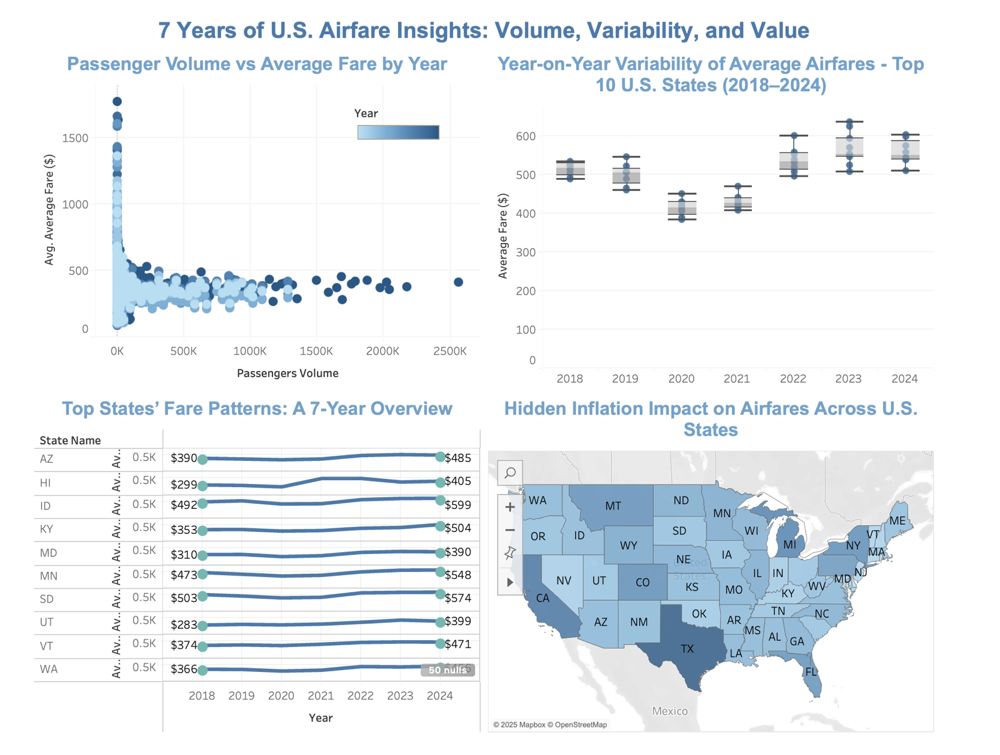

# U.S. Airfare Trend Analytics, 2018–2024

How U.S. airfares and passenger volume moved before and after the pandemic, by state, city and
airport, and how much of the change inflation hides. Graduate project (Sep–Dec 2024), built in Tableau.

**Explore the live views on Tableau Public:**
[Pre- vs post-pandemic airfare trends](https://public.tableau.com/views/Prevs_PostPandemicAirfareTrends/PreandPostPandemic) ·
[2018–2024 airfare overview](https://public.tableau.com/views/2018-2024Airfare/Dashboard1)

**Full case study:** [ysurya18.github.io/projects/airfare-trends.html](https://ysurya18.github.io/projects/airfare-trends.html)

## The question

Airfares dropped during the pandemic and then came back. By how much, where, and what does it
look like once you account for inflation?

## Approach

- Cleaned and prepared airport-, city- and state-level fare data from the Bureau of
  Transportation Statistics (BTS) with SQL, Python and Excel.
- Normalized fares into both **nominal and inflation-adjusted** terms, so real changes could be
  separated from price-level effects.
- Built **11 interactive Tableau visualizations**, including state-level choropleth maps such as
  "Hidden Inflation Impact" and "How U.S. Airfares Shifted, 2018–19 vs 2024."

## What the data shows

Across the top 10 states, average fares dipped in 2020–21 and then climbed above their 2018–19
levels from 2022 onward.

## Repository contents

| File | What it is |
|---|---|
| `Pre vs.Post Pandemic Airfare Trends.twb` | Tableau workbook: pre- vs post-pandemic views |
| `2018-2024 Airfare.twbx` | Packaged Tableau workbook: 2018–2024 overview |
| `Data/Downloads/Combined_AverageFare_2018_2024_final.csv` | Cleaned BTS fare data by airport, city and state, with nominal and inflation-adjusted average fares |
| `Project_Report.pdf` | Project report |
| `Presentation_slides.pdf` | Presentation slides |

## Tools

Tableau, SQL, Python, Excel
